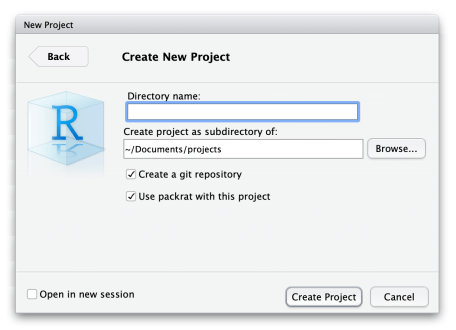
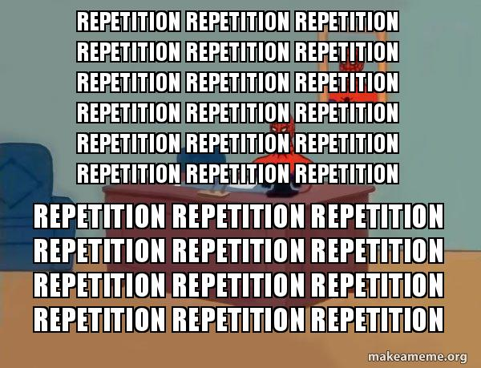

Good practices when working on projects
========================================================
author: Hezi Buba
date: 12/06/19
autosize: true
incremental: true


```r
knitr::opts_chunk$set(error = TRUE)
```

A little backstory
========================================================

* MSc project in our lab
* Revisions required for paper resubmission
* Offered to redo the analyses on an existing code 
* Learned a lot
<br/><br/>
<br/><br/>


***

 

Multi-script Project
========================================================
 

***


```r
library(raster)
source("enviroment_data.R")
source("enviroment_data_future.R")

rm(list=ls())
halophila_coordinates<-read.csv("results_asparagopsis/coordinates.csv")
save_path <- "results_asparagopsis/sdm/only minsst maxsst_coordinates_moved_med_asparagopsis/"
...
source("model_selection_formula.R")
...
source("predictors_selection.R")
source("sdm_model_poly.R")
source("combined_model_new.R")
```

Some good practices here
========================================================

* The use of `source()` allows you to break down your project into logical segments.

* `read.csv()` instead of using an RStudio's "Import Dataset" - goes without saying.

* Lack of `setwd("~Users/personal/path/which/only/collaborator/has/")`.

* Results subfolder.

However:

* `rm(list = ls())`. DO NOT USE IT IN SCRIPTS! 


Here Package + Projects
========================================================

`here()` searches and returns your project root directory.

```r
library("here")
setwd("C:/")
getwd()
```

```
[1] "C:/"
```

```r
here()
```

```
[1] "C:/Users/eze36/Documents/multiscriptgoodpracticres"
```


```r
library("ggplot2")
library("here")
plot <- ggplot(mtcars) +
  aes(x = wt, y = mpg)+
  geom_point()
dir.create(here("figures"))
ggsave(here("figures","demofig1.png"))
```


Write every script assuming a fresh R session
========================================================

Eventually you will either:
* Update your R (you know who you are...)
* Send your script to a collaborator
* Work on multiple R sessions simultanously. 


Writing your script with those scenerios in mind will minimize errors caused by depending on your current R session settings. From theory to practice:

R packages
========================================================

Do not assume that a packages is attached _or even installed!_ 

Here are the start of randomly selected scripts from this project:


```r
source("ex1_globals.r")
library(ggplot2)

####

library(nlme)
library(minpack.lm)
library(AICcmodavg)
library(sp)
library(raster)
library(BIOMOD)
library(stats4)

####
```

***


Before we continue...
========================================================
For some odd reason I just couldn't install `ecospat`, one of the used packages. <br/>
After a few frustrating days I realized ecospat is used only for **one** function througout the whole script!


```r
boyce_index <- ecospat.boyce(data_m_p_BO,presence_data, window.w = 0.2)
```

Luckily, GitHub exists. Searching for the package there led me to the repo, where the function was just waiting for me. 


Some Good practices
========================================================

* Don't write `install.packages()` in your script.

* Use `library()` instead of `require()`.

* Write a library loading script.

* Use the `pacman` package to automatically install uninstalled packages

* Use the `packrat` package to contain the packages within your project.

```r
packrat::init("project/path")
```
***

```r
#####libraries needed:
is_inst <- function(pkg) {
  nzchar(system.file(package = pkg))
}
if (!is_inst("pacman")) {install.packages("pacman")}
library("pacman")
p_load(tidyverse,pbapply,doParallel)
```



Keeping your R Session fresh
========================================================

* Restart and rerun your code often.

* Don't set any `.RProfile` settings such as `stringsAsFactors = FALSE`.

* Do not save and load `.RData`!

_Hey what about those week-long-analysis results?! ARE YOU MAD?!?_

1. Seperate the analysis into a seperate script.
2. Use `saveRDS()` to save the results object.
3. Use the `.RDS` object on the next logical script segment.

***
>The source code is real. The objects are realizations of the source code. - from the [ESS manual](https://ess.r-project.org/Manual/ess.html#Philosophies-for-using-ESS_0028S_0029)

<div align="center">

</div>


Now for the actual coding
========================================================

Check out the attached script `sample_script.R`

<div align="center">

</div>

Creating functions
========================================================
As you can probably see, there are many repetitions in the code. Especially towards the end.

<div align="center">

</div>

To understand why we prefer to write functions than to copy+paste + replace, and learn more on how to write functions, click [here](https://ecodatasci-tlv.github.io/functions/functionswithrupdated.html#/).


Creating a dataframe from iterations
========================================================


```r
coef_b <- matrix(nrow = 0, ncol=5)
for (i in 1:100){
  ...
  ...
  m1Results <- coda.samples(model1, m1Pars, settings$samples*settings$thin, thin=settings$thin)
  
  #analyzing the data:
  coef_b <- rbind(coef_b, as.matrix(m1Results))
}
```

This code snippet will run slowly and take a lot of memory. Let's demonstrate using the `bench` package.

bench::mark
========================================================

Let's set two functions.


```r
f1 <- function() {
  result <- matrix(nrow = 0, ncol=100)
  for (i in seq_len(100)){
    output <- matrix(1:1e5,ncol = 100)
    result <- rbind(result, output) 
  }
  result1 <- as.data.frame(result) 
  return(result1)
}
f2 <- function() {
  list.of.result <- lapply(seq_len(100), function(i) 
  as.data.frame(matrix(1:1e5,ncol = 100)))
result2 <- do.call(what = dplyr::bind_rows,args = list.of.result)
}

bench::mark(f1(),f2())
```

```
# A tibble: 2 x 6
  expression      min   median `itr/sec` mem_alloc `gc/sec`
  <bch:expr> <bch:tm> <bch:tm>     <dbl> <bch:byt>    <dbl>
1 f1()          2.18s    2.18s     0.459    2.03GB     13.8
2 f2()       317.29ms 337.76ms     2.96   230.75MB     13.3
```

apply ohana (also purrr::map)
========================================================
<br/><br/>
<font size = 20>Ohana means family. Family means nobody gets left behind or forgotten - _Lilo and Stitch_ </font size>

The apply family is a great way to iterate. Most commonly used:

* `lapply()` - takes a list as input, returns a list.
* `apply()` - takes an array as input (matrix or dataframe), returns either a list or an array.


```r
apply(matrix(1:100,10,10),2,mean)
```

```
 [1]  5.5 15.5 25.5 35.5 45.5 55.5 65.5 75.5 85.5 95.5
```

While on the topic...
========================================================


```r
mysteryfunction <- function(matrix) {
  return(apply(matrix,2,mean)
}
```

What does this function do?


While on the topic...
========================================================


```r
apply_colmeans <- function(matrix) {
  return(apply(matrix,2,mean))
}
```

Let's compare it with `colMeans()`


```r
matrix <- matrix(runif(1e6),1000)
bench::mark(colMeans(matrix),apply_colmeans(matrix))
```

```
# A tibble: 2 x 6
  expression                  min   median `itr/sec` mem_alloc `gc/sec`
  <bch:expr>             <bch:tm> <bch:tm>     <dbl> <bch:byt>    <dbl>
1 colMeans(matrix)          803us  833.2us    1117.     32.3KB      0  
2 apply_colmeans(matrix)     12ms   13.8ms      69.0    19.2MB     21.9
```

`colMeans()` is much faster because it is a **vectorized** function. If you have the need for speed, read more about vectorization [here](http://alyssafrazee.com/2014/01/29/vectorization.html). 

pbapply package
========================================================
An amazing package that displays a progress bar whenever you use an `*apply()` function.


```r
pbapply::pbapply(matrix(1:100,10,10),2,mean)
```

```
 [1]  5.5 15.5 25.5 35.5 45.5 55.5 65.5 75.5 85.5 95.5
```

<br/><br/>
...
<br/><br/>
Well, not here. But try it on your machines!

Also... `pbapply` allows for _parallel computing_...


Parallel Processing 
========================================================


In my quest for speeding things up in this project I turned to parallel processing.

_What is parallel processing?_

R sadly only makes use of one core of your CPU. So, if you have 8 cores - R will only use **1/8th of your CPU potential!**

And this is where parallel processing comes into play - you perform your computation parallelly on multiple cores.

Let's demonstrate:


```r
bench::mark(pbapply::pblapply(1:8,function(i) Sys.sleep(10)))
```

```
# A tibble: 1 x 6
  expression                                          min median `itr/sec`
  <bch:expr>                                        <bch> <bch:>     <dbl>
1 pbapply::pblapply(1:8, function(i) Sys.sleep(10)) 1.34m  1.34m    0.0124
# ... with 2 more variables: mem_alloc <bch:byt>, `gc/sec` <dbl>
```

As you can see, this code takes 8*10 = 80seconds to run if you don't parallelize it.

parallel and doParallel packages
========================================================

Let's repeat the above example. But first, we will set up and register a cluster.


```r
cluster <- parallel::makeCluster(8)
doParallel::registerDoParallel(cluster)
```

This tells R to register 8 cores, where each will run a single R process.

We continue with the apply:


```r
bench::mark(pbapply::pblapply(1:8,function(i) Sys.sleep(10),cl = cluster))
```

```
# A tibble: 1 x 6
  expression                                                        min
  <bch:expr>                                                      <bch>
1 pbapply::pblapply(1:8, function(i) Sys.sleep(10), cl = cluster)   10s
# ... with 4 more variables: median <bch:tm>, `itr/sec` <dbl>,
#   mem_alloc <bch:byt>, `gc/sec` <dbl>
```

We finish be closing the cluster with:


```r
parallel::stopCluster(cluster)
```


Some things to take into considerations:
==============

objects are not automatically exported to clusters!


```r
a <- c(1:8)
f <- function(i) {return(i*2)}
cluster <- parallel::makeCluster(8)
doParallel::registerDoParallel(cluster)
pbapply::pblapply(1:8,function(i) f(a[i]) ,cl = cluster)
```

```
Error in checkForRemoteErrors(val): 8 nodes produced errors; first error: could not find function "f"
```

```r
parallel::stopCluster(cluster)
```

Exporting Objects to your clusters
==================


```r
a <- c(1:8)
f <- function(i) {return(i*2)}
cluster <- parallel::makeCluster(8)
doParallel::registerDoParallel(cluster)
parallel::clusterExport(cluster,c("a","f"))
pbapply::pblapply(1:8,function(i) f(a[i]) ,cl = cluster)
```

```
[[1]]
[1] 2

[[2]]
[1] 4

[[3]]
[1] 6

[[4]]
[1] 8

[[5]]
[1] 10

[[6]]
[1] 12

[[7]]
[1] 14

[[8]]
[1] 16
```

```r
parallel::stopCluster(cluster)
```

This applies to packages as well.. I pass the library to each cluster call like so:


```r
#for example
parallel::clusterCall(clusters, function() library(tidyverse))
```


Take home messages
=====================================

What's comfortable for you may not be as intuitive to your collaborators.
<br/>
<br/>
<br/>
What's comfortable for you _right now_ may not be as intuitive to _future you!_

Make sure to adopt good practices early on, so you can easily work on other people's code and they can easily understand and work on your code.

R is an evolving language - it is good to stay updated.

Programming is a skill - with time and practice we all get better. 
